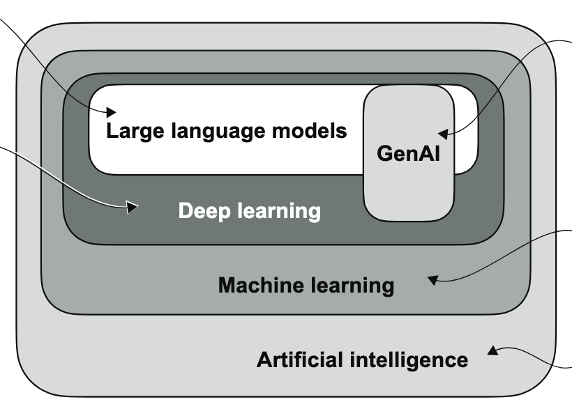
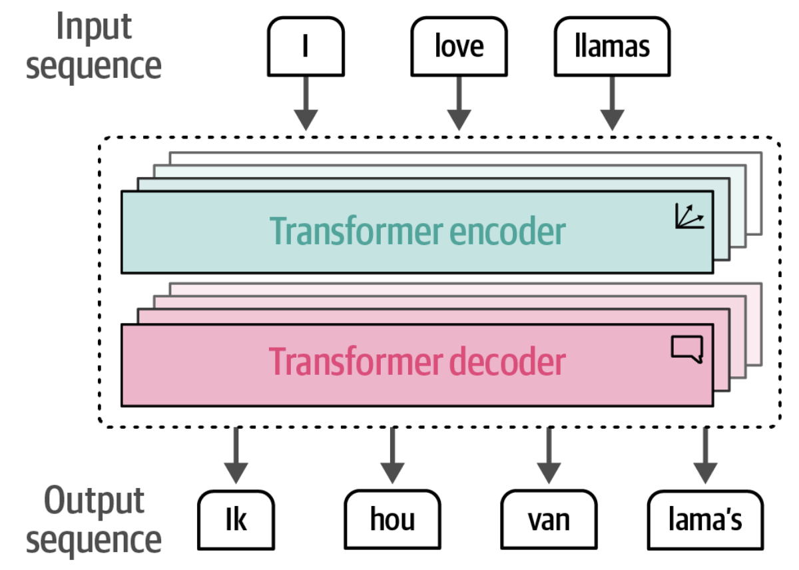
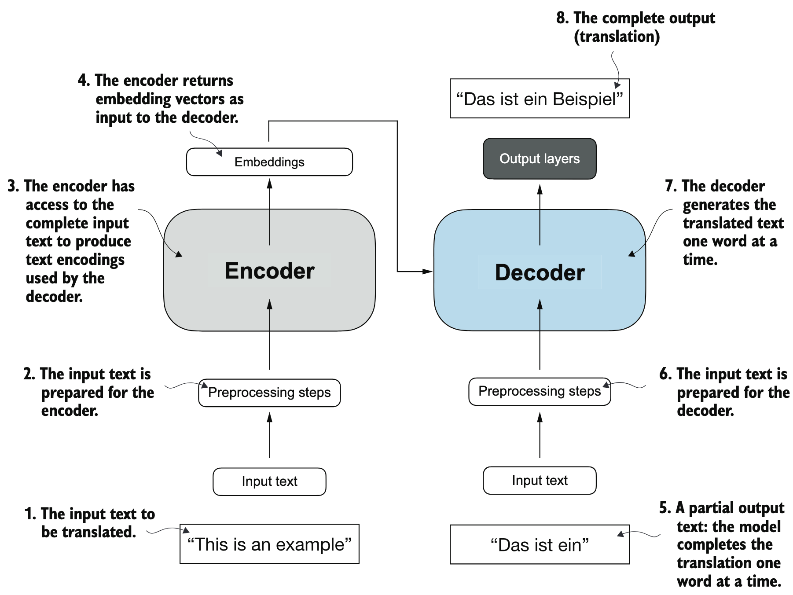
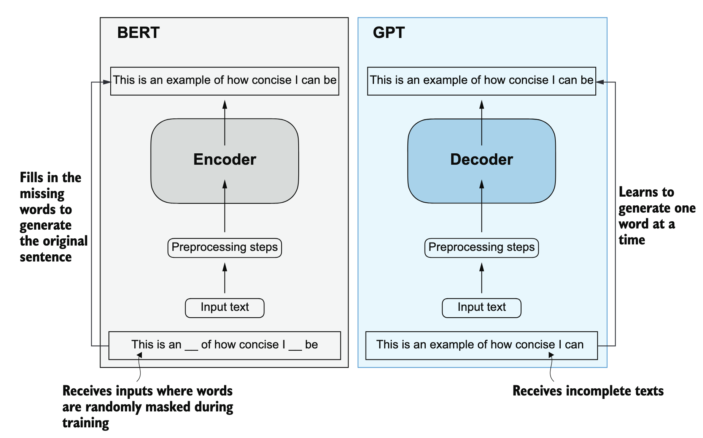
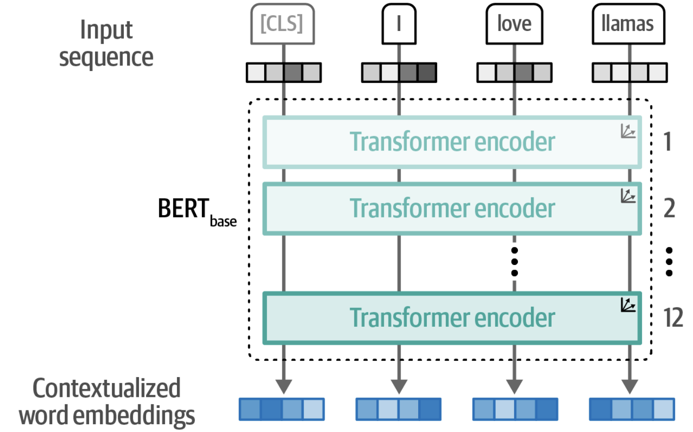
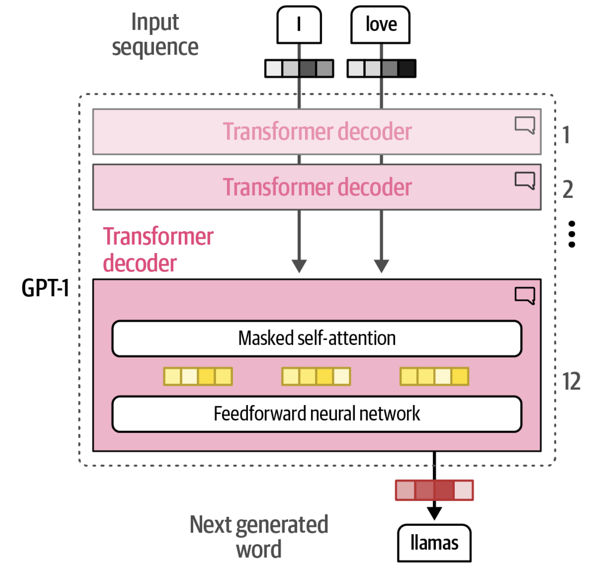
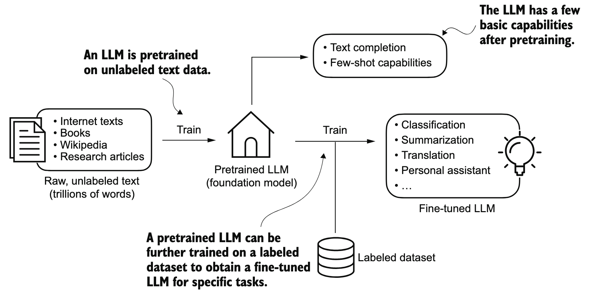
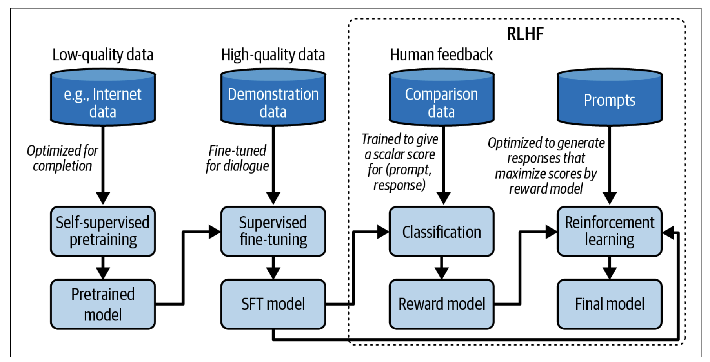

# LLM Landscape

## What is LLM

### LLM跟AI、ML、DL、GenAI的关系

### LLM跟NLP的关系

> LLMs have transformed the field of natural language processing, which previously mostly relied on explicit rule-based systems and simpler statistical methods. The advent of LLMs introduced new deep learning-driven approaches that led to advancements in understanding, generating, and translating human language. （传统NLP使用基于规则的系统或者简单的统计方法，LLM完全改变了NLP这个领域）

> Foundation models mark a breakthrough from the traditional structure of AI research. For a long time, AI research was divided by data modalities. Natural language processing (NLP) deals only with text. Computer vision deals only with vision. （Foundation model甚至进一步把NLP和CV等多模态统一了起来）

### Language Model相关术语

Language Model

> A language model encodes statistical information about one or more languages.

两类语言模型

> Masked language model. A masked language model is trained to predict missing tokens anywhere in a sequence, using the context from both before and after the missing tokens. In essence, a masked language model is trained to be able to fill in the blank. 典型例子：BERT.

> Autoregressive language model. An autoregressive language model is trained to predict the next token in a sequence, using only the preceding tokens. 典型例子：GPT.

Large Language Model

> The “large” in “large language model” refers to both the model’s size in terms of parameters and the immense dataset on which it’s trained.

Foundation Model / Base Model

> The word foundation signifies both the importance of these models in AI applications and the fact that they can be built upon for different needs.

Multimodal Model and Large Multimodal Model (LMM)

> A model that can work with more than one data modality is also called a multimodal  model. A generative multimodal model is also called a large multimodal model  (LMM).

Small Language Model (SLM)

> they use fewer parameters, have a smaller memory footprint, and require less computational power. That makes them suitable for applications that run on mobile or edge devices or on-premises servers or small clusters. SLMs typically range from a few hundred million to a few billion parameters; there’s no official cutoff, but most stay under 10 billion parameters. 大小其实是相对的，所谓小模型，在几年前也是大模型。这跟大数据的“大”是一回事。

## History

**2013 Embedding**

Word Embedding：词从离散符号变成连续向量。

**2014 Attention**

Encoder–Decoder与Attention成为神经机器翻译主流。

**2017 Transformer**

Attention Is All You Need；Self-Attention取代RNN，奠定现代LLM架构基础。

**2018 Pre-training**

Pre-training到Fine-tuning范式确立；Transformer开始全面进入NLP。

**2020 Scaling**

Scaling成为核心路线；Few-shot/In-context Learning崭露头角。

**2022 Alignment & Chat**

LLM从语言模型变成可交互助手，11月ChatGPT引爆公众关注。

**2023 GenAI**

Generative AI元年；能力跃迁+Open Weights+AI应用生态爆发。

**2024 Multimodal & MoE**

从纯文本走向多模态；MoE、长上下文、推理能力成为主线。

**2025 Reasoning**

Test-time Compute/Reasoning成为新的Scaling方向；训练时Scaling到推理时Scaling。

**2026 Agents & AI Systems**

LLM从生成文本进一步走向推理、工具使用、Agent、长程任务执行；系统效率成为核心竞争力。

## Transformer

### Original Transformer

Input/Output

Steps:

### BERT vs GPT

BERT

GPT

### Transformer到底是什么？

本质上，Transformer是一个深度神经网络架构，深度学习的基本原理和视角都可以用来解释Transformer架构。

更深层的，Transformer不仅仅是一个神经网络模型，而是一种经过验证的成功的计算范式。

* Token作为统一的计算表示；
* Attention作为核心算子，进行动态计算（动态关联、路由、聚合）；
* Scaling law（规模化）是有效的；
* pretraining是有效且必要的；
* Tensor/GPU作为底层计算单元和硬件。

## Training

Language modeling / pretraining

> The first step in creating a high-quality LLM is to pretrain it on one or more massive text datasets. During training, it attempts to predict the next token to accurately learn linguistic and semantic representations found in the text. The resulting model is often referred to as a foundation model or base  model.

Fine-tuning / post-training

> Fine-tuning or sometimes post-training, involves using the previously trained model and further training it on a narrower task. This allows the LLM to adapt to specific tasks or to exhibit desired behavior. Additional fine-tuning steps can be added to further align the model with the user’s preferences.

Fine-tuning分为两步

Fine-tuning 1 (supervised fine-tuning):

> The two most popular categories of supervised fine-tuning LLMs are instruction fine-tuning and classification fine-tuning. In instruction fine-tuning, the labeled dataset consists of instruction and answer pairs, such as a query to translate a text accompanied by the correctly translated text. In classification fine-tuning, the labeled dataset consists of texts and associated class labels—for example, emails associated with “spam” and “not spam” labels.

Fine-tuning 2 (preference tuning)

> The final step further improves the quality of the model and makes it more aligned with the expected behavior of AI safety or human preferences. This is called preference tuning. Preference tuning is a form of fine-tuning and, as the name implies, aligns the output of the model to our preferences, which are defined by the data that we give it.

## From Training to Serving

TODO

## Reasoning

TODO

## Applications

TODO

## References

**《AI Engineering》**

AI Engineering: Building Applications with Foundation Models. Chip Huyen. 2025.

**《HOLLM》**

Hands-On Large Language Models: Language Understanding and Generation. Jay Alammar (Author), Maarten Grootendorst. 2024.

**《LLM from Scratch》**

Build a Large Language Model (From Scratch). Sebastian Raschka.

**《Reasoning from Scratch》**

Build a Reasoning Model (From Scratch). Sebastian Raschka. 2026.

**《DeepSeek from Scratch》**

Build a DeepSeek Model (From Scratch). Raj Abhijit Dandekar (Author), Rajat Dandekar (Author), Naman Dwivedi (Author), Sreedath Pana. 2026.

**《SLM》**

Domain-Specific Small Language Models: Efficient AI for local deployment. Guglielmo Iozzia. 2026.

**《HOLLMSO》**

Hands-On LLM Serving and Optimization: Hosting LLMs at Scale. Chi Wang and Peiheng Hu. 2026.
